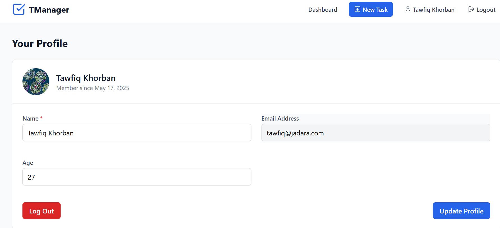

# TManager - Task Management Application

TManager is a full-stack task management web app built with the **MERN Stack** (MongoDB, Express.js, React.js, Node.js). It allows users to register, log in, and manage their daily tasks with ease through features like creation, update, deletion, filtering, and sorting — all inside a clean and responsive interface styled with **Tailwind CSS**.

---

## ✨ Features

- **User Authentication**: Secure signup and login with JWT
- **Task Management**: Create, read, update, and delete tasks
- **Task Organization**: Filter and sort tasks based on status, priority, and deadlines
- **Profile Management**: Update profile information and upload avatar images
- **Responsive Design**: Fully responsive UI that works on desktop and mobile devices

---

## ⚙️ Tech Stack

### Frontend

- **React.js**: UI library for building the interface
- **React Router**: For client-side routing
- **Tailwind CSS**: For styling components
- **Lucide React**: Icon library
- **React Hot Toast**: For notifications
- **Axios**: For API requests

### Backend

- **Node.js & Express.js**: Server framework
- **MongoDB & Mongoose**: Database and ODM
- **JWT**: For authentication
- **Bcrypt.js**: For password hashing
- **Multer**: For file uploads
- **Express Validator**: For input validation
- **Dotenv**: For environment variables

---

## 📂 Folder Structure

```
task-manager/
├── client/                 # Frontend React application
│   ├── public/             # Static assets
│   ├── src/
│   │   ├── components/     # Reusable UI components
│   │   ├── contexts/       # React contexts (auth)
│   │   ├── pages/          # Application pages
│   │   ├── services/       # API services
│   │   ├── utils/          # Helper functions
│   │   ├── App.jsx         # Main app component
│   │   └── main.jsx        # Entry point
│   ├── .env                # Frontend environment variables
│   └── package.json        # Frontend dependencies
│
└── Server/                 # Backend Express application
    ├── config/             # Database configuration
    ├── controllers/        # Route controllers
    ├── middleware/         # Custom middleware
    ├── models/             # Mongoose models
    ├── routes/             # API routes
    ├── uploads/            # User uploaded files
    ├── public/             # Public assets (avatars)
    ├── .env                # Backend environment variables
    ├── server.js           # Server entry point
    └── package.json        # Backend dependencies
```

---

## 📦 How to Run Locally

### Prerequisites

- Node.js (v14 or later)
- MongoDB (local or Atlas)

### Backend Setup

```bash
# Navigate to the server directory
cd Server

# Install dependencies
npm install

# Create a .env file with the following variables
# MONGO_URI=your_mongodb_connection_string
# JWT_SECRET=your_jwt_secret
# PORT=3000
# CLIENT_URL=http://localhost:5173
# NODE_ENV=development
# AVATAR_UPLOAD_PATH=uploads/avatars
# MAX_FILE_SIZE=5242880
# JWT_EXPIRY=5d
# DEFAULT_AVATAR_PATH=/defaults/default-avatar.png
dd
# Start the server
npm start
# For development with auto-restart
npm run server
```

### Frontend Setup

```bash
# Navigate to the client directory
cd client

# Install dependencies
npm install

# Create a .env file with the following variables
# VITE_API_BASE_URL=http://localhost:3000
# VITE_DEFAULT_AVATAR_PATH=/defaults/default-avatar.png
# VITE_AUTH_TOKEN_KEY=taskManagerToken
# VITE_AUTH_USER_ID_KEY=UserId

# Start the development server
npm run dev
```

Visit `http://localhost:5173` to see the application running.

---

## 🔌 API Endpoints

### Authentication

- `POST /api/users/register` - Register a new user
- `POST /api/users/login` - Login a user
- `GET /api/users/me` - Get current user information
- `PUT /api/users/profile` - Update user profile
- `POST /api/users/avatar` - Upload user avatar

### Tasks

- `POST /api/tasks/create` - Create a new task
- `GET /api/tasks` - Get all tasks
- `GET /api/tasks/:id` - Get a specific task
- `PUT /api/tasks/:id` - Update a task
- `DELETE /api/tasks/:id` - Delete a task
- `GET /api/tasks/filter/results` - Filter and sort tasks

---

## 🚀 Deployment

### Backend

The backend can be deployed to platforms like:

- Render
- Heroku
- DigitalOcean
- AWS

### Frontend

The React frontend can be deployed using:

- Vercel
- Netlify
- GitHub Pages
- Firebase Hosting

---

## 💻 Environment Variables

### Backend (.env)

```
MONGO_URI=your_mongodb_connection_string
JWT_SECRET=your_jwt_secret
PORT=3000
CLIENT_URL=http://localhost:5173
NODE_ENV=development
AVATAR_UPLOAD_PATH=uploads/avatars
MAX_FILE_SIZE=5242880
JWT_EXPIRY=5d
DEFAULT_AVATAR_PATH=/defaults/default-avatar.png
```

### Frontend (.env)

```
VITE_API_BASE_URL=http://localhost:3000
VITE_DEFAULT_AVATAR_PATH=/defaults/default-avatar.png
VITE_AUTH_TOKEN_KEY=taskManagerToken
VITE_AUTH_USER_ID_KEY=UserId
```

---

## 🤝 Contributing

Contributions are welcome! Please feel free to submit a Pull Request.

1. Fork the project
2. Create your feature branch (`git checkout -b feature/amazing-feature`)
3. Commit your changes (`git commit -m 'Add some amazing feature'`)
4. Push to the branch (`git push origin feature/amazing-feature`)
5. Open a Pull Request

---

## 📸 Screenshots

Here are some screenshots of the application:


_User authentication interface where users can sign in to their accounts_


_User profile page where users can update their personal information_


_Main dashboard showing tasks with filtering and sorting capabilities_

---

## 📜 License

Distributed under the MIT License. See `LICENSE` for more information.

---

## 📧 Contact

Oussama bouhiri - oussamabouhiri@gmail.com

Project Link: https://github.com/oussamabouhiri/task-manager
